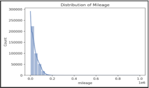
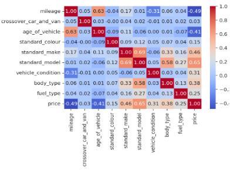
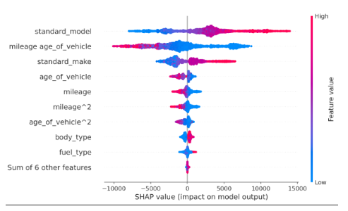

# Car-Price-Prediction
This project aims to develop a model to predict the selling price of cars based on a dataset provided by AutoTrader. The solution is structured to handle various stages of the ML pipeline, including data processing, feature engineering, and model evaluation.

## Project Overview

The primary goal is to explore and build a predictive model for car prices. Key tasks include data processing, feature engineering, feature selection, model building, and evaluation.

## Dataset
The dataset contains information about various vehicles, including mileage, make, model, condition, year of registration, price, and more.

### Key Stages and Findings
1. **Data Processing**
    - Distribution analyses revealed right-skewed distributions in `mileage` and `price`, as shown in the plots below:
      - 
      - 
    - Outliers were identified and removed based on quantiles to improve data quality.
    - Categorical encoding and target encoding were applied to handle high-dimensional categories efficiently.
      
  2. **Feature Engineering**
    - A new feature, `age_of_vehicle`, was derived from the registration year.
    - Polynomial and interaction features were created to capture non-linear relationships, particularly between `mileage`, `vehicle condition`, and `crossover_car_and_van` type.

  3. **Feature Selection and Dimensionality Reduction**
    - Domain knowledge and a heat map were used to identify core features with the highest correlations to price:
      - 
    - Automated feature selection (K-Best and RFECV) further refined the feature set:
      - 

4. **Model Building and Evaluation**
    - Three models were evaluated: Linear Regression (LR), Random Forest (RF), and Gradient Boosting (GB).
    - A voting regressor ensemble was created but found to underperform relative to the Random Forest model alone.
    - Cross-validation showed that Random Forest achieved the lowest Mean Absolute Error (MAE), suggesting it as the best model.

5. **Explainability with SHAP**
    - SHAP analysis revealed the impact of features like `standard_model`, `mileage_age_of_vehicle`, and `standard_make` on the model’s predictions:
      - 
    - These features had complex, varied impacts on price, informing insights useful for targeted marketing, inventory management, and customer education.
